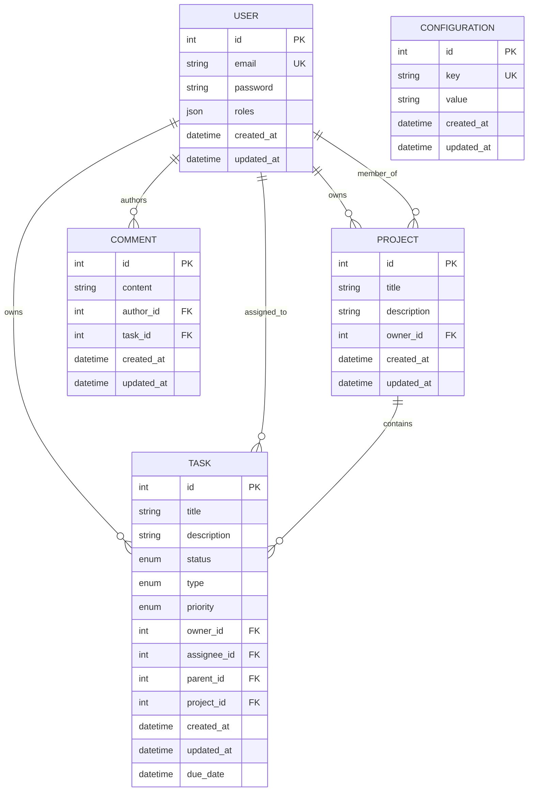

# Symfony DDD Service

Symfony service demonstrating Domain-Driven Design (DDD) and Command Query Responsibility Segregation (CQRS) patterns.  
This project is a PHP-based API structured as a service following DDD principles.

## Table of Contents
- [Overview](#overview)
- [Technology Stack](#technology-stack)
- [Prerequisites](#prerequisites)
- [Configuration](#configuration)
- [Installation & Setup](#installation--setup)
- [Running the Application](#running-the-application)
- [API Documentation](#api-documentation)
- [Architecture Overview](#architecture-overview)
- [Authentication](#authentication)
- [Entity Relationship Diagram](#entity-relationship-diagram)
- [Testing](#testing)
- [How to Contribute](#how-to-contribute)
- [License](#license)

## Overview

This is a PHP-based application built with Symfony that enables users to manage tasks, projects, and team collaboration. The system features user authentication, task organization, project grouping, and commenting functionality. It follows Domain-Driven Design principles with a modular architecture.

## Technology Stack

- **Backend**: PHP 8.1+, Symfony 7.4.*
- **Database**: MySQL
- **Caching**: Redis
- **Authentication**: JWT with refresh tokens
- **DevOps**: Docker, Docker Compose

## Prerequisites

Before you begin, ensure you have met the following requirements:

- **Docker** (version 20.10 or higher)
- **Docker Compose** (version 2.0 or higher)
- **Git** (version 2.0 or higher)

## Configuration

### Environment Variables

Key environment variables in `.env.local`:

- `APP_ENV`: Application environment (dev, prod, test)
- `DB_HOST`, `DB_PORT`, `DB_NAME`, `DB_USER`, `DB_PASSWORD`: Database connection
- `HTTP_PORT`: Port for the web server
- `REDIS_HOST`, `REDIS_PORT`, `REDIS_PASSWORD`: Redis configuration
- `JWT_SECRET_KEY`, `JWT_PUBLIC_KEY`, `JWT_PASSPHRASE`: JWT configuration


## Installation & Setup

### 1. Clone the Repository

```bash
git clone https://github.com/yognevoy/symfony-ddd-service.git
cd symfony-ddd-service
```

### 2. Copy Environment Configuration

```bash
cp .env .env.local
```

### 3. Build and Start Containers

```bash
docker-compose up -d --build
```

### 4. Install PHP Dependencies

```bash
# Enter the PHP container
docker exec -it symfony_ddd_service_php bash

# Install dependencies
composer install
```

### 5. Generate JWT Keys

```bash
mkdir -p config/jwt
openssl genrsa -out config/jwt/private.pem -aes256 4096
openssl rsa -pubout -in config/jwt/private.pem -out config/jwt/public.pem
```

### 6. Set Up Database

```bash
# From inside the PHP container
php bin/console doctrine:database:create
php bin/console doctrine:migrations:migrate
```

## Running the Application

### Starting Services

```bash
docker-compose up -d
```

### Stopping Services

```bash
docker-compose down
```

### Accessing Services

- **API**: http://localhost:8000/api
- **MySQL**: localhost:3306 (for external connections)
- **Redis**: localhost:6379 (for external connections)

## API Documentation

### Authentication Flow

1. **Login**: Send credentials to `/api/login_check` to obtain JWT token
2. **Access Protected Resources**: Include `Authorization: Bearer [token]` header
3. **Token Refresh**: Use `/api/token/refresh` endpoint when token expires

### Available Endpoints

#### User Management
- `POST /api/register` - Register a new user
- `POST /api/login_check` - Authenticate user and get JWT token
- `POST /api/token/refresh` - Refresh expired JWT token
- `GET /api/users` - Get all users (pagination supported)
- `GET /api/users/{id}` - Get specific user
- `PUT /api/users/{id}` - Update user information
- `DELETE /api/users/{id}` - Delete user

#### Task Management
- `GET /api/tasks` - Get all tasks (with filtering and pagination)
- `GET /api/tasks/{id}` - Get specific task
- `POST /api/tasks` - Create new task
- `PUT /api/tasks/{id}` - Update task
- `DELETE /api/tasks/{id}` - Delete task

#### Project Management
- `GET /api/projects` - Get all projects
- `GET /api/projects/{id}` - Get specific project
- `POST /api/projects` - Create new project
- `PUT /api/projects/{id}` - Update project
- `DELETE /api/projects/{id}` - Delete project

#### Comment Management
- `GET /api/comments` - Get all comments
- `GET /api/comments/{id}` - Get specific comment
- `POST /api/comments` - Create new comment
- `PUT /api/comments/{id}` - Update comment
- `DELETE /api/comments/{id}` - Delete comment

#### Configuration Management
- `GET /api/config` - Get all configuration values (admin only)
- `POST /api/config` - Set configuration values (admin only)

### Example Requests

#### User Registration
```bash
curl -X POST http://localhost:8000/api/register \
  -H "Content-Type: application/json" \
  -d '{
    "email": "user@example.com",
    "password": "password"
  }'
```

#### User Login
```bash
curl -X POST http://localhost:8000/api/login_check \
  -H "Content-Type: application/json" \
  -d '{
    "email": "user@example.com",
    "password": "password"
  }'
```

#### Get Tasks (with authentication)
```bash
curl -X GET http://localhost:8000/api/tasks \
  -H "Authorization: Bearer JWT_TOKEN"
```

## Architecture Overview

### Bounded Contexts

- [User](src/User): User management and authentication functionality. Handles user registration, login, profile management, and role-based access control.
- [Task](src/Task): Core task management features. Enables creating, updating, deleting, and organizing tasks with priorities, statuses, and due dates.
- [Project](src/Project): Project management features. Enables organizing tasks into projects with team collaboration and member management.
- [Comment](src/Comment): Comment system for tasks and projects. Allows adding comments for communication and discussion.
- [Config](src/Config): Configuration management domain. Handles system-wide configuration values and settings with admin access controls.
- [Shared](src/Shared): Shared Kernel: Common infrastructure and domain components shared between the different bounded contexts.

### Hexagonal Architecture

This repository follows the Hexagonal Architecture pattern.
The structure of a Bounded Context is:

```scala
$ tree -L 4 src

src
├── Task // Task subdomain / Bounded Context
│   ├── Application // Application layer - use cases, DTOs, commands, queries
│   │   ├── Command // Command handlers for write operations
│   │   │   ├── CreateTask
│   │   │   │   ├── CreateTaskCommand.php
│   │   │   │   └── CreateTaskCommandHandler.php
│   │   │   └── UpdateTask
│   │   │       ├── UpdateTaskCommand.php
│   │   │       └── UpdateTaskCommandHandler.php
│   │   ├── Query // Query handlers for read operations
│   │   │   ├── GetTask
│   │   │   │   ├── GetTaskQuery.php
│   │   │   │   └── GetTaskQueryHandler.php
│   │   │   └── GetAllTasks
│   │   │       ├── GetAllTasksQuery.php
│   │   │       └── GetAllTasksQueryHandler.php
│   │   └── Controller // API controllers
│   │       └── TaskController.php
│   ├── Domain // Domain layer - business logic and entities
│   │   ├── Entity // Domain entities
│   │   │   └── Task.php
│   │   ├── Enum // Domain enums
│   │   │   ├── TaskPriority.php
│   │   │   └── TaskStatus.php
│   │   └── Repository // Repository interfaces
│   │       └── TaskRepositoryInterface.php
│   └── Infrastructure // Infrastructure layer - implementations
│       ├── Repository // Repository implementations
│       │   └── TaskRepository.php
│       └── Persistence // Persistence configurations
│           └── Doctrine
│               └── Mapping
│                   └── Task.orm.xml
└── Shared // Shared Kernel: Common infrastructure and domain shared between the different Bounded Contexts
```

### Command Query Responsibility Segregation (CQRS)

The application implements CQRS pattern to separate read and write operations. Commands modify system state through dedicated handlers, while queries retrieve data without changing state. This separation allows for optimized data models for each operation type and improved scalability.


### Repository pattern

Repositories follow a consistent interface pattern with methods like `find`, `findAll`, `findBy`. The domain repositories define contracts in the Domain layer, with implementations located in the Infrastructure layer.

An example [here](src/Task/Domain/Repository/TaskRepositoryInterface.php)
and its implementation [here](src/Task/Infrastructure/Repository/TaskRepository.php).

### Entities

An example of an entity [here](src/Task/Domain/Entity/Task.php). All entities follow domain-driven design principles with proper encapsulation and business logic.

### Command Bus

There is one implementation of the [Command Bus](src/Shared/Infrastructure/Bus/CommandBus.php) using the Symfony Message Bus.

### Query Bus

The [Query Bus](src/Shared/Infrastructure/Bus/QueryBus.php) using the Symfony Message Bus.

### Event Bus

The application supports event-driven architecture through the Symfony Messenger component for asynchronous processing of commands and events.

## Authentication

The application uses JWT (JSON Web Token) for stateless authentication with refresh token support. The authentication flow works as follows:

1. **Login**: User authenticates with credentials at `/api/login_check` to receive an access token
2. **Access**: Users includes the JWT token in the `Authorization: Bearer [token]` header for protected endpoints
3. **Refresh**: When the access token expires, user uses `/api/token/refresh` endpoint with the refresh token to get a new access token
4. **Registration**: New users can register at `/api/register` endpoint

The system implements role-based access control (RBAC) with different permission levels for users and administrators.

## Entity Relationship Diagram



## Testing

### Running Tests

```bash
# Run all tests
docker exec -it symfony_ddd_service_php ./bin/phpunit
```

### Test Structure

- **Unit Tests**: Test individual classes and functions in isolation
- **Integration Tests**: Test interactions between multiple components
- **Functional Tests**: Test complete API endpoints and workflows

## How to Contribute

If you find a bug or have a feature request, please check the [Issues page](https://github.com/yognevoy/symfony-ddd-service/issues) before creating a new one. For code contributions, fork the repository, make your changes on a new branch, and submit a pull request with a clear description of the changes. Please make sure to test your changes thoroughly before submitting.

## License
This project is licensed under the MIT License - see the [LICENSE.txt](https://github.com/yognevoy/symfony-ddd-service/blob/main/LICENSE.txt) file for details.
